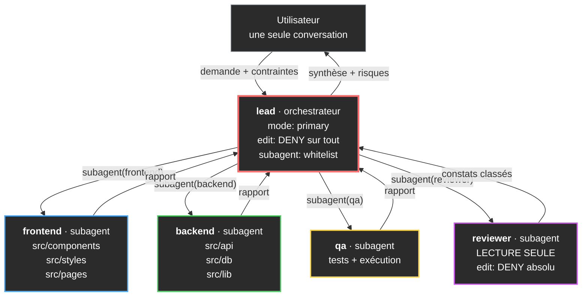
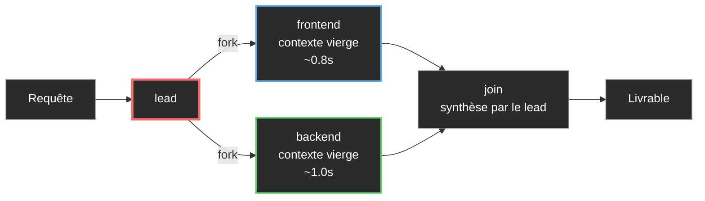

# Construire une équipe d'agents IA pour le développement web

**Younes El Fakir** — DEP Soutien informatique, Cégep de Longueuil

> **Note de laboratoire / article de portfolio.** Projet d'apprentissage personnel, pas une
> livraison client. Le code est réel et exécutable ; les limites sont documentées honnêtement.

---

## Résumé

On peut donner à un modèle IA une **personnalité par conversation** : c'est ce que j'appelle le *soul*.
Dans OpenCode V2, ce *soul* a un nom technique — **l'agent** — et c'est un objet de configuration
à part entière : un prompt système, un modèle, et un jeu de permissions.

Reste la vraie question : **comment faire travailler plusieurs agents ensemble sur un même projet web ?**

C'est ce que j'ai monté. Cinq agents, un chef d'équipe, et un système de permissions
qui empêche chaque agent d'écrire hors de sa zone.

```
lead  ──▶ frontend ─┐
  │  ──▶ backend  ─┼──▶ rapport ──▶ lead ──▶ toi
  │  ──▶ qa       ─┤
  └──▶ reviewer  ─┘
```

Les trois choses que cet exercice m'a apprises, et qu'auc cours ne m'avait appris :

1. **La spécialisation bat le modèle unique.** Diviser par responsabilité coûte plus de tokens, mais
   chaque sous-agent reçoit des instructions courtes et ciblées au lieu d'un prompt omniscient.
2. **Les permissions sont la vraie sécurité, pas le prompt.** Demander poliment à un agent de ne pas
   toucher aux migrations SQL ne sert à rien. `effect: deny` à l'exécutable, oui.
3. **Le parallélisme est le seul vrai gain de temps.** Tout le reste — hiérarchie, synthèse — est
   de l'organisation, pas de la vitesse.

---

## Table des matières

- [1. Le point de départ](#1-le-point-de-départ)
- [2. Le modèle mental](#2-le-modèle-mental-un-agent-cest-quatre-choses)
- [3. L'architecture](#3-larchitecture-de-léquipe)
- [4. Le cycle de délégation](#4-le-cycle-de-délégation-en-un-échange)
- [5. Les permissions comme garde-fous](#5-les-permissions-comme-garde-fous)
- [6. Le parallélisme](#6-le-parallélisme-le-seul-vrai-gain-de-temps)
- [7. Le code](#7-le-code-complet-de-léquipe)
- [8. Ce que j'ai appris — et où ça casse](#8-ce-que-jai-appris--et-où-ça-casse)
- [9. Compétences transférables](#9-compétences-transférables)
- [10. Reproduire l'expérience](#10-reproduire-lexpérience)
- [Conclusion](#conclusion)

---

## 1. Le point de départ

Quand on donne une tâche de développement web à un seul modèle, voici ce qui se passe :

```
"construis un formulaire de contact, il faut que ce soit joli, accessible, et qu'il
ne soit pas vulnérable aux injections SQL"
```

Un modèle unique reçoit tout, raisonne sur tout, et produit une réponse *moyennement* bonne sur
chaque axe. Personne n'a vraiment garanti la sécurité. Personne n'a vraiment vérifié
l'accessibilité. C'est le problème classique du généraliste : il couvre large, il n'excelle
nulle part.

L'alternative, c'est l'entreprise. Une équipe type :

| Rôle | Responsabilité | Ne touche jamais à |
|---|---|---|
| Développeur backend | API, base, auth | les composants React |
| Développeur frontend | Composants, styles, a11y | les requêtes SQL |
| QA | Tests, reproduction de bugs | — (il casse les trucs) |
| Reviseur | Lecture, critique | rien du tout, par construction |
| Chef de projet | Découpe, délègue | ne code pas lui-même |

C'est exactement ce que j'ai reproduit dans OpenCode — **sauf** que chaque membre est un modèle IA,
et que les permissions sont des règles d'exécutable plutôt que des conventions sociales.

---

## 2. Le modèle mental : un agent, c'est quatre choses

Un agent OpenCode V2 est un **profil nommé**. Quatre composants, pas un de plus :

```yaml
description:   # à quoi il sert — lu par le modèle qui choisit de le lancer
system:        # son prompt système — sa personnalité
model:         # quel modèle, provider/model#variant
permissions:   # ce qu'il a le droit de faire
```

Il vit dans un fichier Markdown, `agents/<nom>.md` :

```md title="agents/frontend.md"
---
description: Ingénieur frontend — React, CSS, composants, accessibilité, perf de rendu
mode: subagent
---

Tu es l'ingénieur frontend d'une équipe web. Tu écris l'interface.
```

Le corps du fichier Markdown **est** le prompt système. C'est le détail qui m'a arrêté : écrire
un agent, c'est écrire une fiche de poste.

### Trois modes, et ça change tout

| Mode | Rôle | Utilisation |
|---|---|---|
| `primary` | Agent principal d'une session | Le chef d'équipe. Un seul par session. |
| `subagent` | Enfant via l'outil `subagent` | Les ingénieurs. Frais contexte obligatoire. |
| `all` | Les deux | Un agent polyvalent |

Une session ne peut avoir **qu'un seul** agent primary. Les autres sont forcément des enfants.
C'est une contrainte d'architecture, pas un choix de design : ça force à décider explicitement
qui dirige.

### Personnalité par conversation

Chaque session stocke son propre agent et son propre modèle. C'est exactement le « soul » demandé
au début :

```sh
# Créer une session déjà opérationnelle avec un agent précis
opencode api post /api/session --data '{"agent":"lead","title":"Formulaire de contact"}'

# Changer d'avis en cours de conversation
opencode api post /api/session/<id>/agent --data '{"agent":"reviewer"}'
```

Dans le TUI : `/agents`, ou `Shift+Tab` pour cycler. Et côté configuration, `default_agent` ne
s'applique **qu'aux sessions qui n'ont pas encore choisi** — changer cette valeur ne réécrit
jamais une session existante. Petit détail qui évite beaucoup de confusion.

---

## 3. L'architecture de l'équipe



Trois choix structurants ici :

**Le chef n'a pas le droit d'écrire.** `edit: deny` sur toute ressource. Ce n'est pas une
convention, c'est une règle. S'il veut changer une ligne, il délègue. Ça l'oblige à vraiment
découper au lieu de bidouiller vite fait — et ça rend les rapports d'agents fiables, puisque
personne ne peut avoir silencieusement modifié le travail d'un autre.

**Le reviewer ne peut rien faire.** Un `deny` global, puis seulement `read`, `glob`, `grep`,
`webfetch` ré-ouverts. Il est *structurellement* incapable de modifier le code qu'il critique.
C'est le seul moyen d'éviter le biais classique du reviewer qui « corrige au passage ».

**Les permissions sont une whitelist, pas une liste noire.** Pour `lead` :

```yaml
permissions:
  - action: subagent
    resource: "*"
    effect: deny      # d'abord tout fermer
  - action: subagent
    resource: frontend
    effect: allow     # puis rouvrir un par un
  - action: subagent
    resource: backend
    effect: allow
  - action: subagent
    resource: qa
    effect: allow
  - action: subagent
    resource: reviewer
    effect: allow
```

L'ordre compte : **la dernière règle qui matche gagne**. Donc `* → deny` en premier, exceptions
ensuite. L'inverse donnerait un `allow` générique que les exceptions ne peuvent plus rattraper.
C'est exactement la logique d'un pare-feu, et c'est le principe du moindre privilège.

---

## 4. Le cycle de délégation, en un échange

```mermaid
sequenceDiagram
    autonumber
    actor U as Utilisateur
    participant L as lead
    participant F as frontend
    participant B as backend
    participant R as reviewer

    U->>L: "Ajoute un formulaire de contact"
    L->>U: question — quel stack ?
    Note over U,L: Le chef clarifie AVANT de déléguer.<br/>Ne jamais deviner le framework.

    U-->>L: "Next.js, Tailwind, API Express"

    rect rgb(38,43,54)
        Note over F,B: Contexte vierge — chaque enfant repart de zéro
        par en parallèle
            L->>F: "ContactForm accessible, champs name+email+message, validation client"
            F-->>L: "src/components/contact-form.tsx — prêt"
        and
            L->>B: "POST /api/contact, validation zod, rate limit"
            B-->>L: "src/api/contact.ts + schema — prêt"
        end
    end

    L->>R: "Relis les changements"
    R-->>L: "2 mineurs, 1 majeur : pas de rate limit effectif"

    L->>B: "Corrige le rate limit"
    B-->>L: "corrigé"

    L-->>U: synthèse — fichiers, décisions, risques, ce qui reste ouvert
```



Deux détails dans ce diagramme qui font toute la différence :

**`par ... and ... end`.** Les deux ingénieurs travaillent *simultanément*. C'est le seul moment
où l'équipe est réellement plus rapide qu'un agent seul.

**Le rect `Note over F,B`.** Le contexte vierge est le prix à payer. Un sous-agent ne sait **rien**
de la discussion. Chaque délégation doit donc être autosuffisante : la tâche, le contexte utile,
le résultat attendu. Un `subagent` mal briefé est le premier motif d'échec de tout le système.

---

## 5. Les permissions comme garde-fous

Le tableau ci-dessous est la politique effective de l'équipe. Rien n'y est négocié par le modèle.

| Agent | lecture | écriture | shell | Lance des sous-agents |
|---|---|---|---|---|
| `lead` | tout | **interdite** | — | frontend, backend, qa, reviewer |
| `frontend` | tout | `src/components`, `src/styles`, `src/pages` | — | non |
| `backend` | tout | `src/api`, `src/server`, `src/db`, `src/lib` | — | non |
| `qa` | tout | tout | `ask` | non |
| `reviewer` | tout | **interdite** | — | non |

### Pourquoi des chemins plutôt que des outils

Une alternative naïve serait d'autoriser l'agent `edit` partout mais de lui dire dans le prompt
« ne touche qu'à `src/api` ». **Ça ne protège de rien.** Le prompt est une instruction, la
permission est une contrainte d'exécution. Si un sous-agent déraille et décide que le « problème »
est dans un fichier voisin, il l'écrira. La permission l'en empêche physiquement.

C'est le point que je retiens de tout cet exercice, et il déborde largement de l'IA : **une règle
qui n'est pas appliquée par le système est une règle qui sera violée au moment où ça coûte cher.**

### Pourquoi ces chemins demanderont à être réalignés

Les permissions sont écrites en chemins littéraux, donc elles cassent dès que l'arborescence
change. C'est un compromis assumé : la sécurité contre la souplesse. Sur un vrai projet, il faut
que ces chemins suivent `package.json` et la structure réelle — sinon le premier `src/api`
inexistant transforme une règle en `deny` silencieux qui bloque tout le monde sans explication.

---

## 6. Le parallélisme, le seul vrai gain de temps

Le reste de l'architecture — hiérarchie, permissions, rapports — est de l'**organisation**.
Une seule chose est de la **vitesse** : lancer plusieurs enfants en même temps.

```
requête ---+--> frontend   [############............]   0.8 s
          |              contexte vierge
          |
          +--> backend    [####################]   1.0 s
          |              contexte vierge
          |
          +--> lead       [..............########]   attend les deux
```

| Séquence | Temps | Explication |
|---|---|---|
| 1 agent | 1.8 s | fait tout dans le même contexte |
| 2 agents en série | 1.8 s | backend puis frontend, l'un après l'autre |
| 2 agents en parallèle | 1.0 s | le parent attend seulement le plus lent |



Le gain n'est pas `n × agents`. Il est borné par la tâche la plus lente. Sur une tâche
« formulaire + API », on passe de ~1.8s à ~1.0s. Sur une tâche cognitive comme « concevoir
l'architecture d'un site e-commerce », le parallélisme n'aide pas du tout — et ça, on ne le voit
qu'en le mesurant.

> **Règle que j'ai retenue : paralléliser ce qui est réellement indépendant.** Deux tâches qui
> touchent le même fichier doivent aller au même agent, en série. Les faire tourner en parallèle
> produit deux versions divergentes du même fichier et un conflit que personne n'arbitrera.

---

## 7. Le code complet de l'équipe

Structure du dépôt — c'est aussi la structure à copier chez vous :

```
agents/               # les profils d'agents
  lead.md             # orchestrateur, primary
  frontend.md         # subagent, périmètre components/styles/pages
  backend.md          # subagent, périmètre api/server/db/lib
  qa.md               # subagent, tests
  reviewer.md         # subagent, lecture seule
commands/
  review.md           # /review → lance une revue en arrière-plan
opencode.example.jsonc# config d'exemple avec les permissions
```

### `agents/lead.md`

```md
---
description: Chef de projet web — découpe, délègue aux ingénieurs, synthétise
mode: primary
color: "#ff6b6b"
permissions:
  - action: subagent
    resource: "*"
    effect: deny
  - action: subagent
    resource: frontend
    effect: allow
  - action: subagent
    resource: backend
    effect: allow
  - action: subagent
    resource: qa
    effect: allow
  - action: subagent
    resource: reviewer
    effect: allow
  - action: edit
    resource: "*"
    effect: deny
---

Tu es le chef d'équipe d'un projet web. Tu ne codes pas toi-même : tu coordonnes.

## Méthode

1. **Clarifie** avant de déléguer. Si la demande est ambiguë, pose une question.
   Ne devine pas le stack.
2. **Découpe** en tâches indépendantes. Une tâche = un agent. Si deux tâches
   touchent les mêmes fichiers, elles vont au même agent, en séquence.
3. **Délègue** avec l'outil `subagent`. Chaque appel contient la tâche en une phrase,
   le contexte utile et le résultat attendu. Un sous-agent a un contexte vierge.
4. **Parallélise** quand les tâches sont réellement indépendantes — `background: true`.
5. **Synthétise** : ce qui a été fait, les fichiers touchés, ce qui reste ouvert.

## Règles

- Ne modifie aucun fichier de projet toi-même.
- Si un sous-agent échoue, lis son rapport et ajuste la consigne. Ne relance pas à l'aveugle.
- Si une permission est refusée, ne contourne pas. Signale-le.
- Préférer 2 agents en parallèle à 5 en série.
```

### `agents/reviewer.md` — le plus intéressant

```md
---
description: Revue de code en lecture seule — trouve les bugs avant merge
mode: subagent
color: "#cc5de8"
permissions:
  - action: "*"
    resource: "*"
    effect: deny
  - action: read
    resource: "*"
    effect: allow
  - action: glob
    resource: "*"
    effect: allow
  - action: grep
    resource: "*"
    effect: allow
---

Tu es le relecteur de l'équipe web. Tu ne modifies **rien**. Tu lis et tu signales.

## Ce que tu cherches, par ordre d'importance

1. **Vrais bugs** — conditions inversées, off-by-one, `null` non géré,
   `await` manquant, état mutable partagé.
2. **Sécurité** — injection SQL/XSS, secrets en dur, contrôle d'accès manquant,
   données d'un utilisateur exposées à un autre.
3. **Rupture de contrat** — appel d'API désynchronisé de la route, migration
   non propagée, prop supprimée encore utilisée.
4. **Complexité inutile** — duplication, abstraction premature, code mort.

Ce qui n'est **pas** un problème : le style, le nommage, le formatage.
Ne les signale pas.

## Rapport

Classe par gravité. Pour chaque point : `fichier:ligne`, le problème, une
suggestion concrète. Maximum 8 points. Si tu n'en as pas de graves, dis-le
franchement.
```

Le cœur du prompt du reviewer, ce n'est pas la liste de ce qu'il doit chercher — c'est la liste
de ce qu'il **ne doit pas** signaler. Sans elle, un modèle produit invariablement une liste de
critiques de style qui noie les vrais bugs. Réduire le bruit, c'est déjà le rendre utile.

### Délégation par commande

```md title="commands/review.md"
---
description: Lance une revue de code en arrière-plan
agent: reviewer
subagent: true
---

Revois $ARGUMENTS. Classe les constats par gravité, du plus bloquant au plus mineur.
```

`subagent: true` envoie la commande dans une session enfant. La session parente garde son agent
et son modèle — tu peux continuer à travailler pendant que la revue tourne.

---

## 8. Ce que j'ai appris — et où ça casse

C'est la section qui compte le plus pour moi. Les trois premières règles sont celles que je
n'avais pas anticipées.

### 8.1 Le contexte vierge est le vrai coût du sous-agent

Un sous-agent repart de zéro à chaque fois. Il ne voit ni la discussion, ni les décisions
précédentes, ni les fichiers déjà modifiés par son frère. Conséquences concrètes :

- **Chaque délégation est un mini-brief autonome.** Trois lignes de contexte inutiles, ça vaut
  mieux qu'un « fais ce qu'on a dit » qui ne veut rien dire.
- **Deux sous-agents ne se parlent pas.** Le seul canal de retour est le parent. Ça veut dire
  qu'une équipe de 5 est en fait une **étoile**, pas un maillage. Si `frontend` a besoin d'une
  décision de `backend`, c'est `lead` qui doit la transporter.
- **Pas de mémoire entre sessions.** Pour de la continuité, il faut passer par des fichiers
  (`AGENTS.md`, un dossier de notes). Il n'y a pas de mémoire partagée native.

### 8.2 `general` ne peut pas déléguer

L'agent `general` livré avec OpenCode a une permission native qui lui **interdit** de lancer des
sous-agents. C'est logique — il est conçu comme uningleton de secours — mais ça casse l'envie
naturelle de l'utiliser comme chef d'équipe. Il faut écrire son propre orchestrateur avec
`mode: all` pour de l'orchestration imbriquée.

### 8.3 Un sous-agent n'hérite pas des permissions du parent

Un agent custom qui a `allow` partout peut écrire n'importe où, **sans jamais demander**. C'est
l'inverse de ce qu'on attend intuitivement : « mon fils a moins de droits que moi ». Non. Il a
exactement les droits qu'on lui a écrits. Si tu écris un sous-agent sans bloc `permissions`,
tu viens d'ouvrir un bulldozer.

### 8.4 La règle par défaut est permissive

Tous les agents, y compris les custom, démarrent avec cette politique de base :

```jsonc
[
  { "action": "*",              "resource": "*", "effect": "allow" },
  { "action": "external_directory", "resource": "*", "effect": "ask" },
  { "action": "read",           "resource": "*.env", "effect": "ask" }
]
```

`allow` partout en première position. C'est bien pour la productivité, c'est mal pour tout le
reste. **Si tu ne restreins pas un agent explicitement, il n'est restreint nulle part.**

### 8.5 Ce que cette architecture ne fait pas

Soyons clair sur les limites, parce que c'est ce qui distingue une note de laboratoire d'une
publicité :

- **Pas de coordination entre frères.** Vrai fork/join, mais ni vote ni consensus.
- **Pas de reviewer automatique en boucle.** Il faut le demander explicitement. Une vraie
  *review loop* (`coder → reviewer → coder`) se code, elle n'existe pas nativement.
- **Pas de partage de contexte ni de mémoire.** Voir 8.1.
- **Le coût ne disparaît pas.** Un sous-agent a son propre contexte system + ses tokens. Diviser
  en 4 agents sur une petite tâche peut coûter **plus** cher qu'un agent seul.

> Si tu veux une équipe qui dialogue vraiment, il faut écrire ton orchestrateur sur l'API HTTP
> ou le SDK. Les sous-agents natifs sont des **appels ponctuels**, pas des workers persistants.

---

## 9. Compétences transférables

Le propos est l'IA, mais ce qui s'apprend ici ne l'est pas :

| Ce que j'ai pratiqué | Où ça sert en support informatique |
|---|---|
| **Moindre privilège** — whitelist par défaut, exceptions explicites | Droits NTFS, rôles AD, politiques GPO |
| **Pare-feu** — règle large d'abord, exceptions ensuite, dernier match gagne | Règles pare-feu Windows, GPO, WAF |
| **Découpage en responsabilités** — qui a le droit de faire quoi | Séparation des tâches, gestion des accès |
| **Documentation d'exécution** — chaque agent rend un rapport | Ticketing, gestion d'incidents, runbooks |
| **Mesurer avant d'optimiser** — le gain du parallélisme est borné | Toute décision de performance |
| **Savoir dire « je ne sais pas »** — documenter les limites | Escalade, honnêteté opérationnelle |

Le point 3 est celui que jeJH Aspects le plus sous-estimé. La matrice des permissions de la
section 5, c'est une **table d'habilitation**. C'est exactement l'objet qu'on manipule au quotidien
sur un Active Directory, et le raisonnement est transposable tel quel : qui a le droit de faire
quoi, avec une règle par défaut et des exceptions nommées, pas l'inverse.

---

## 10. Reproduire l'expérience

```sh
# 1. Cloner
git clone https://github.com/youneselfakir0/equipe-agents-opencode.git

# 2. Installer les agents
cp -r agents  ~/.config/opencode/
cp -r commands ~/.config/opencode/
```

Sur Windows PowerShell :

```powershell
Copy-Item -Recurse agents   "$env:USERPROFILE\.config\opencode\"
Copy-Item -Recurse commands "$env:USERPROFILE\.config\opencode\"
```

OpenCode recharge automatiquement — pas besoin de redémarrer.

```sh
# 3. Lister les agents détectés
opencode api get /api/agent

# 4. Dans le TUI : /agents  ou  Shift+Tab  pour passer sur "lead"
```

### Vérifier que les permissions tiennent

Le test qui compte, c'est de tenter l'interdit et de constater le refus :

```text
Use le subagent frontend pour ajouter une migration dans src/db/migrations/
```

Le `frontend` doit être **refusé** par la règle `{ action: edit, resource: "*", effect: deny }`.
Si l'agent écrit quand même, tes permissions ne sont pas chargées — vérifie que le fichier est
bien dans `~/.config/opencode/agents/` et non dans le dossier du projet.

---

## Conclusion

Le résultat est modeste et c'est normal : cinq fichiers Markdown et un bloc de permissions. Mais
les principes qu'ils encodent ne sont pas spécifiques à OpenCode.

Ce que j'emporte :

1. **Décomposer par responsabilité avant de choisir un modèle.** La spécialisation des agents est
   un vieux truc de l'ingénierie logicielle — interfaces, dépendances, couplage faible —
   appliqué à des collaborateurs qui ne sont pas déterministes.
2. **Une contrainte non appliquée par le système n'est pas une règle.** Le moment où ça compte,
   c'est quand quelqu'un d'autre reprend le code à 2h du matin et n'a pas lu les instructions.
3. **La vitesse vient du parallélisme, l'intelligence vient de la décomposition.** Confondre les
   deux, c'est embaucher cinq agents qui font tous la même chose en même temps.

Et la prochaine étape est évidente : un orchestrateur maison sur l'API HTTP, avec une vraie
boucle `coder → reviewer → coder` et un état partagé entre les agents. C'est ce que je vise
maintenant.

---

## Références

- [OpenCode V2 — Agents](https://opencode.ai/v2/docs/agents)
- [OpenCode V2 — Permissions](https://opencode.ai/v2/docs/permissions)
- [OpenCode V2 — Instructions](https://opencode.ai/v2/docs/instructions)
- [OpenCode V2 — Commands](https://opencode.ai/v2/docs/commands)

---

**Younes El Fakir** — DEP Soutien informatique, Cégep de Longueuil
Projet personnel d'apprentissage. Les fichiers de ce dépôt ont réellement servi à produire
les schémas de cet article.
